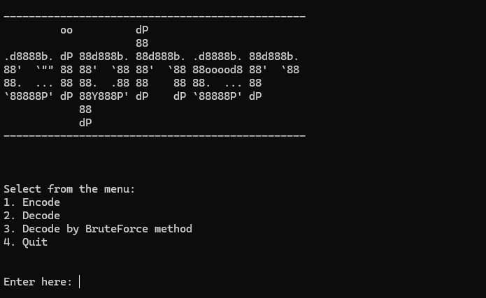

# Caesar Cipher Encoder/Decoder

This Python program provides a simple implementation of a Caesar Cipher Encoder/Decoder with the following features:

- **Encode**: Encrypt a message using a shift key.
- **Decode**: Decrypt a message using a shift key.
- **Brute Force Decode**: Attempt to decode a message by testing all possible shift keys.

The program features a user-friendly command-line interface and a clean menu for navigating the options.

## Features

- **Encode**: Encrypts plain text using a given key (shift value).
- **Decode**: Decrypts an encoded message using a given key.
- **Brute Force Decode**: Tries all possible keys to decode the message.

